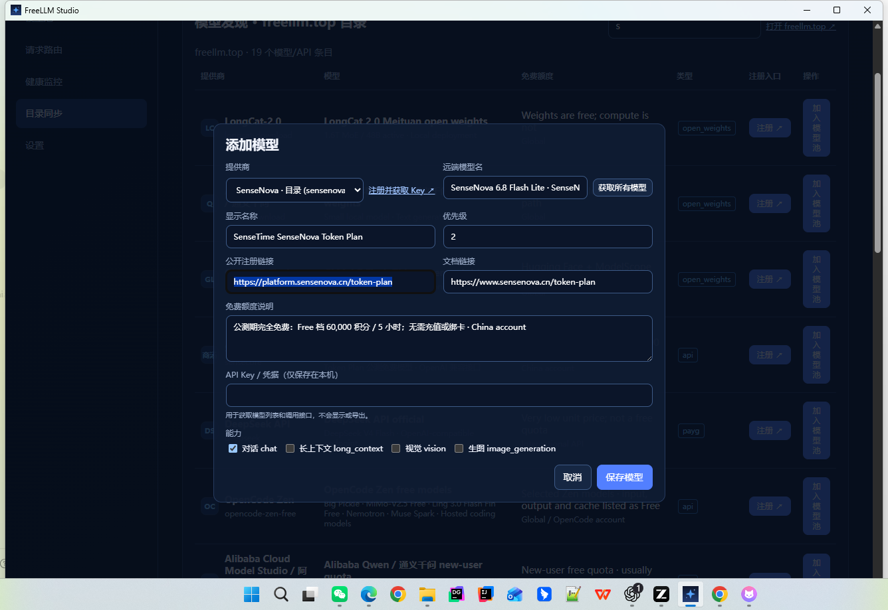

# 智能底座 · FreeLLM Gateway

FreeLLM Gateway 是智能底座的模型接入与运行核心：统一管理多个 Provider 和模型，通过兼容 API、基础路由与故障切换，为本地应用和研发团队提供可自托管的 AI Gateway。Agent、工具、知识与工作流是产品路线图，不代表当前仓库已提供这些能力。

> 当前产品以自托管 / 单实例为主。下方“现有能力”只描述仓库当前具备的行为；“路线图”标注规划方向。多租户隔离、完整调用方 Key 管理和 Agent OS 能力需要按路线图另行交付。

## 产品文档

- [智能底座 PRD](docs/product/SMART_BASE_PRD.md)：定位、用户故事、P0/P1/P2 范围和验收标准。
- [测试计划](docs/testing/SMART_BASE_TEST_PLAN.md)：端到端验收矩阵、测试方法和阶段状态。
- [管理台首页原型](docs/prototypes/smart-base/prototype.html)：Trace Map 交互原型（演示数据，不连接后端）；[视觉方向比较页](docs/prototypes/smart-base/index.html)。



## 快速运行

### Windows：一条命令

仓库根目录执行：

```powershell
.\run.ps1
```

脚本会自动创建 `.venv`、安装 Python 包，并在首次启动时自动安装/构建 React/TypeScript 管理后台，然后打开：

```text
http://127.0.0.1:8765/admin/
```

之后再次运行会复用已经生成的前端 bundle。需要只启动服务、不自动打开浏览器：

```powershell
.\run.ps1 -NoBrowser
```

### macOS / Linux

```bash
sh ./run.sh
```

### 从 CI wheel 运行

GitHub Actions 的成功构建会产生 artifact：`freellm-gateway-runnable-wheel`。下载 wheel 后：

```bash
python -m venv .venv
# Windows: .\.venv\Scripts\activate
# macOS/Linux: source .venv/bin/activate
pip install freellm_gateway-*.whl
python -m freellm_gateway run --open-browser
```

wheel 已包含 React 管理后台，**运行时不需要 Node.js**。

## 当前能力

| 能力 | 当前状态 |
|---|---|
| Provider 与模型连接管理、模型发现和探测 | 已支持 |
| OpenAI 兼容模型、聊天和生图入口 | 已支持；具体参数与模态以当前接口为准 |
| 按模型能力、健康状态和优先级路由 | 已支持基础策略 |
| 上游线路失败切换 | 已支持基础 Fallback；高级策略和错误治理仍在路线图中 |
| Provider 凭据保护 | 桌面端使用系统凭据存储，云端使用加密持久文件；不会通过目录导出或接口响应回显明文 |
| Usage、配额、Tenant / App | 有基础统计与配置能力；完整租户隔离、调用方 Key 生命周期和成本治理尚未完成 |
| 健康和请求记录 | 有基础健康检查与连接记录；完整 Trace、错误聚合和告警尚未完成 |
| FreeLLM Studio 桌面控制台 | Windows 桌面版可自动启动本地网关 |

## 路线图

- **P0：统一调用闭环**：多 Provider 调用、基础 Fallback、Usage/请求记录和密钥保护。
- **P1：多租户运营**：调用方 Key、配额与成本、Tenant / App 治理、高级路由、告警和完整 Trace。
- **P2：Agent 能力平台**：Agent、Tools、Skills、Workflow、Knowledge、Memory 和 Evaluation。

路线图不代表当前版本承诺或已实现能力；具体阶段按 PRD 验收后更新本表。

## 功能

- 从 Provider API 获取多个模型，一次性批量加入模型池
- 每个模型独立启用、停用、探测、删除和调整优先级
- 支持文本、长上下文、视觉和生图能力标签
- 从 `freellm.top` 目录带出 Provider、注册地址、文档和额度说明
- 管理台支持批量选择多个连接，分别验证凭据、选择模型后批量保存
- Windows 桌面版启动时自动运行网关，不弹出 CMD 窗口

## API 调用联调

在仓库根目录执行：

```powershell
python scripts/simulate_client_call.py
```

该脚本会启动隔离的本地 Gateway，通过真实 HTTP 请求调用 `/v1/chat/completions`，并检查应用密钥鉴权、响应、`X-Request-ID`、路由日志和 Usage。Provider 使用确定性测试适配器，不会访问外部模型服务或消耗模型额度。

## 桌面版

直接运行构建产物：

```powershell
desktop/src-tauri/target/release/freellm-studio.exe
```

桌面版会自动启动网关、打开管理台，并将 Provider 注册页转交系统浏览器。

构建桌面版需要 Node.js、Rust stable、Visual Studio C++ Build Tools 和 Python 3.10+。仓库根目录执行：

```powershell
.\scripts\build_desktop.ps1
```

脚本会依次构建 React 管理台、带 React 静态资源的 Python sidecar，并构建 Tauri/NSIS 桌面应用。快速 Debug 验证：

```powershell
.\scripts\build_desktop.ps1 -Debug
```

更多桌面构建说明见 [`desktop/README.md`](desktop/README.md)。

## 单实例云部署

仓库已提供生产 Docker 镜像、`/data` 持久卷约定、加密 Provider 密钥存储、
`/health/ready` 就绪检查以及 Caddy 自动 HTTPS 示例。

当前云部署必须保持 **1 个应用实例 / 1 个副本**；SQLite 与 in-flight 配额
reservation 还不是多实例共享架构。完整步骤见
[`docs/CLOUD_DEPLOYMENT.md`](docs/CLOUD_DEPLOYMENT.md)。

快速构建：

```bash
docker build -t freellm-gateway:local .
```

自托管 VPS 可使用：

```bash
cp .env.cloud.example .env.cloud
# 填写真实域名、API/Admin Token 和 Fernet Secret Key
docker compose --env-file .env.cloud -f docker-compose.cloud.yml up -d --build
```

## 开发运行

```powershell
python -m venv .venv
.\.venv\Scripts\Activate.ps1
python -m pip install -e ".[test]"
python -m pytest -q
python -m freellm_gateway run --host 127.0.0.1 --port 8765 --open-browser
```

管理页面：`http://127.0.0.1:8765/admin`

OpenAPI 文档：`http://127.0.0.1:8765/docs`

网关接口：`http://127.0.0.1:8765/v1`

## 添加 Provider 和模型

1. 打开“添加模型”，选择目录中的 Provider；注册地址、Base URL 和文档会自动带出。
2. 在 Provider 官网注册并创建 API Key，将 Key 粘贴到窗口。
3. 点击“获取所有模型”。
4. 所有返回模型会一次性加入模型池；取消某项的“启用”即可让它保持停用状态。
5. 保存后，可以在模型池中单独测试、启用或停用每个模型。

如果目录或 Provider 提供多条线路，可使用“多连接添加”：勾选连接后逐条验证 Key，分别选择模型，再批量保存。不同 Base URL 会作为不同连接保留；一条线路失败不会隐藏其他线路。

### AtomGit CodingPlan 本机 sidecar

FreeLLM Gateway 不读取 AtomGit/AtomCode 的 `auth.toml`，也不保存 OAuth Token 或实现请求签名。请先在你自己的 sidecar 中完成 AtomGit OAuth/CodingPlan 配置，让 sidecar 提供 OpenAI-compatible 接口（默认预设：`http://127.0.0.1:8080/v1`），再在管理台使用“AtomGit CodingPlan（本机 sidecar）”预设，并填写 sidecar 发放的 API Key。

该接入仅面向本人本机使用：sidecar 的启动、地址、Key 和可用模型由用户自行负责；不支持账号轮换、额度规避或公网共享。loopback HTTP 只允许作为 Provider Base URL，注册地址、文档地址和公开连接仍必须使用 HTTPS。

以 OpenRouter 为例，注册和创建 Key：[https://openrouter.ai/keys](https://openrouter.ai/keys)。

### Gemini 原生 REST

在管理台添加 Provider 时填写：

```json
{
  "id": "gemini",
  "name": "Gemini",
  "protocol": "gemini",
  "base_url": "https://generativelanguage.googleapis.com/v1beta",
  "official_url": "https://ai.google.dev"
}
```

然后填写 Gemini API Key，获取模型并加入模型池。外部客户端仍使用本地网关的 OpenAI 兼容接口，例如模型名可填写 `gemini-3.8-flash`。Key 只通过 Gemini 要求的 `x-goog-api-key` 请求头发送，不会写入 URL。

注意：`gemini-2.0-flash` 已于 2026-06-01 关停，请使用当前可用的 Gemini 模型。

## OpenAI 兼容接口

### Groq GPT-OSS 120B

在管理台添加 OpenAI-compatible Provider：

```text
名称：Groq
Base URL：https://api.groq.com/openai/v1
模型：openai/gpt-oss-120b
```

编辑模型路由时，可在“推理强度”中填写 `medium`、`low` 或 `high`。该值作为路由默认值；客户端请求如果自行传入 `reasoning_effort`，则以客户端值为准。

所有请求默认支持：

```http
Authorization: Bearer <FREELLM_GATEWAY_API_TOKEN>
```

也可以使用代理兼容头：

```http
X-Free-LLM-Token: <FREELLM_GATEWAY_API_TOKEN>
```

在 WorkBuddy 托管环境中，反向代理会占用 `Authorization`，因此调用
`/v1/*` 时应使用 `X-Free-LLM-Token`。两种方式在网关内同时保留，
自定义头存在时优先使用它。

```powershell
$headers = @{ Authorization = "Bearer $env:FREELLM_GATEWAY_API_TOKEN" }
Invoke-RestMethod http://127.0.0.1:8765/v1/models -Headers $headers

Invoke-RestMethod http://127.0.0.1:8765/v1/chat/completions `
  -Method Post -Headers $headers -ContentType "application/json" `
  -Body (@{ model="auto"; messages=@(@{ role="user"; content="你好" }) } | ConvertTo-Json)
```

`model` 可以使用 `/v1/models` 返回的路由 ID；使用 `auto` 时，网关会按优先级从上到下尝试启用的模型路由。

支持的接口：

- `GET /v1/models`
- `POST /v1/chat/completions`
- `POST /v1/images/generations`

## 安全说明

默认只监听本机回环地址。请将真实 API Token 放入未纳入 Git 的 `.env` 或系统环境变量，不要提交 API Key、数据库、日志和构建缓存。
